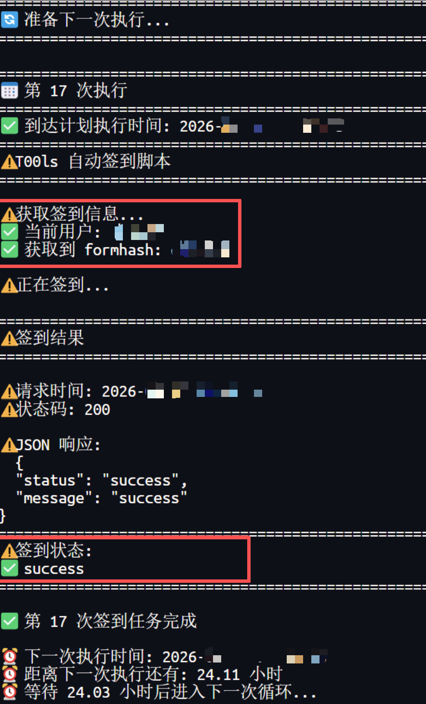
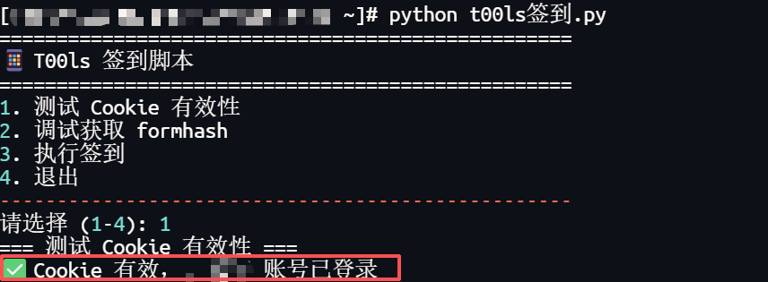

# T00ls 自动签到脚本
# 【仅作为代码展示，请遵守T00ls平台规则，保护好个人账号】
## 简介
两个用于 T00ls 论坛自动签到的 Python 脚本，采用不同的自动化策略：  
```python
1、t00lsQD.py: 循环守护脚本，持续运行，智能时间调度  
2、t00ls签到.py: 交互式脚本，适合手动调试和单次使用 
``` 
**注意**: 两个脚本中的 Cookie 使用前需要自行配置。  

## 核心特性  
**1、智能时间调度 (t00lsQD.py)**  
```python
# 动态计算执行时间，避免固定模式
# 每天在11:30-12:00之间随机时间执行
# 支持长期循环（最长365天）
```
**2、 安全性检查 (t00ls签到.py)**  
```python
# 先检测Cookie是否过期
# 确认登录状态后再执行签到
# 避免发送无效请求
```

## 脚本工作原理
**t00lsQD.py 调度流程**  
```python
1. 计算下一次执行时间（第二天11:30-12:00随机时间）
2. 精确等待到目标时间
3. 获取formhash和用户名
4. 执行签到请求
5. 处理响应并发送通知
6. 回到步骤1，进入下一个循环
```
**t00ls签到.py 执行流程**  
```python
1. 用户选择功能（测试/调试/签到）
2. 如果选择签到：
   a. 检测Cookie有效性
   b. 获取formhash
   c. 执行签到
   d. 显示详细结果
3. 完成后退出
```

## 配置步骤  
**1.克隆或下载脚本**  
```python
git clone <repository-url>
cd t00ls-QD
```
**2.配置必要信息**  
**在两个脚本中都需要设置（注意不要公开这些信息）：**
```python
# 配置信息
COOKIE = 'your_cookie_here'  # 从浏览器获取的T00ls Cookie
```
**3.获取Cookie的方法**  
```python
1. 登录 T00ls 论坛
2. 按 F12 打开开发者工具
3. 进入 Network 标签页
4. 刷新页面
5. 找到任意请求，复制 Request Headers 中的 Cookie 字段
```


## 运行脚本  
运行循环守护脚本 (推荐)
```python
# 自动签到，智能时间调度
python t00lsQD.py
```
运行交互式脚本
```python
# 测试Cookie、调试、单次签到
python t00ls签到.py

# 运行交互式脚本后会显示菜单：
==================================================
📱 T00ls 签到脚本
==================================================
1. 测试 Cookie 有效性
2. 调试获取 formhash  
3. 执行签到
4. 退出
--------------------------------------------------
请选择 (1-4):
```
## 脚本对比
🔄 **t00lsQD.py - 循环守护脚本**  
```python
特点:
├── 持续运行模式（最多365天）
├── 智能时间调度（11:30-12:00随机时间执行）
└── 精确等待到目标时间
```
  
🔧 **t00ls签到.py - 交互式调试脚本**  
```python
特点:
├── Cookie有效性检测（先检测再签到）
├── 模块化调试菜单
├── 详细的调试输出
└── 适合问题排查和单次使用
``` 
  
